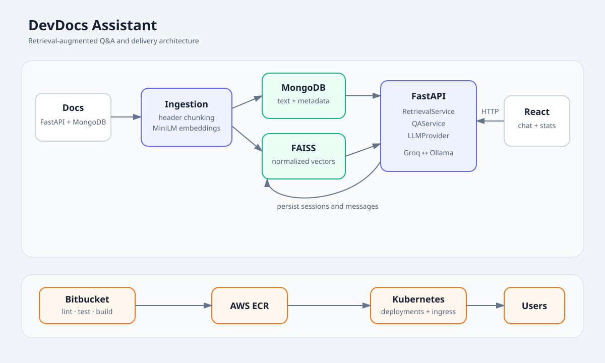

# DevDocs Assistant

DevDocs Assistant is a production-style retrieval-augmented generation (RAG)
application for answering questions about FastAPI and MongoDB. RAG is used instead
of sending a question directly to a general-purpose model so that answers are
grounded in indexed documentation, can expose their sources, and can admit when the
available documentation is insufficient.



Markdown documentation is split along its `##`/`###` hierarchy and embedded with
`all-MiniLM-L6-v2`. MongoDB stores the auditable chunk text and metadata; FAISS
stores normalized vectors for cosine-similarity retrieval. At query time FastAPI
retrieves the best chunks, builds a source-attributed prompt, calls Groq or Ollama
through a small provider interface, persists the turn, and returns structured
citations to React.

## Tech stack

| Layer | Technology |
| --- | --- |
| API | Python 3.11+, FastAPI, Pydantic v2, PyMongo Async |
| Retrieval | sentence-transformers, FAISS (`IndexFlatIP`) |
| Persistence | MongoDB 7 |
| Generation | Groq chat completions or local Ollama |
| Web | React 19, JavaScript, Vite, React Router, Recharts |
| Quality | pytest, mongomock, Ruff, ESLint, Vitest |
| Delivery | Docker, nginx, Bitbucket Pipelines, ECR, Kubernetes |

## Repository layout

```text
backend/              FastAPI app, ingestion script, and tests
frontend/             Vite React application
data/raw/             locally cloned Markdown documentation
data/index/           generated FAISS index and mapping (gitignored)
docs/                 architecture diagram
k8s/                  Kubernetes resources and Kustomize entry point
scripts/              deployment helper scripts
```

## Local setup

Prerequisites are Docker with Compose, or Python 3.11 plus Node 22 for running the
services directly. Copy the example configuration and choose a provider:

```bash
cp backend/.env.example backend/.env
```

For Groq, set `LLM_PROVIDER=groq` and `GROQ_API_KEY`. For the offline path, keep
`LLM_PROVIDER=ollama`, start the optional service, and download a model once:

```bash
docker compose --profile ollama up -d mongodb ollama
docker compose exec ollama ollama pull llama3.1
```

Place cloned documentation below folders whose names contain `fastapi` and
`mongodb` (or `pymongo`), for example:

```text
data/raw/fastapi/docs/en/docs/*.md
data/raw/mongodb/**/*.md
```

Two tiny sample files are committed so the pipeline can be exercised immediately.
They are illustrative notes; replace them with the official repositories for useful
coverage. Build the backend and ingest all Markdown:

```bash
docker compose build backend
docker compose run --rm backend python scripts/ingest.py --raw-dir /app/data/raw
```

The first ingestion downloads the local embedding model. It upserts chunks by a
SHA-256 hash of file, section, and content, then rebuilds the on-disk flat FAISS
index, so reruns do not duplicate documents.

For a local run, conservative native-thread settings avoid Torch/FAISS conflicts,
particularly on Intel macOS:

```bash
cd backend
TOKENIZERS_PARALLELISM=false OMP_NUM_THREADS=1 \
  .venv/bin/python scripts/ingest.py --raw-dir ../data/raw
```

Start the application:

```bash
docker compose --profile ollama up --build
```

Open the UI at [http://localhost:3000](http://localhost:3000), OpenAPI at
[http://localhost:8000/docs](http://localhost:8000/docs), and liveness/readiness at
`/health` and `/ready`.

Do not open `frontend/index.html` directly with a `file://` URL. It is Vite's source
entry point and must be served by `npm run dev`, Docker/nginx, or another HTTP server.

### Important environment variables

| Variable | Default | Purpose |
| --- | --- | --- |
| `MONGODB_URI` | `mongodb://localhost:27017` | Database connection |
| `MONGODB_DATABASE` | `devdocs_assistant` | Database name |
| `LLM_PROVIDER` | `ollama` | `groq` or `ollama` |
| `GROQ_API_KEY` | unset | Required only for Groq |
| `GROQ_MODEL` | `llama-3.3-70b-versatile` | Hosted generation model |
| `OLLAMA_BASE_URL` | `http://localhost:11434` | Ollama server |
| `OLLAMA_MODEL` | `llama3.1` | Local generation model |
| `RETRIEVAL_TOP_K` | `5` | Context chunks per query |
| `RETRIEVAL_CANDIDATE_MULTIPLIER` | `4` | Semantic candidates considered before lexical reranking |
| `RETRIEVAL_MIN_SCORE` | `0.5` | Minimum cosine similarity before a chunk can be used |
| `RETRIEVAL_SEMANTIC_WEIGHT` | `0.65` | Semantic share of the combined reranking score |
| `EMBEDDING_DEVICE` | `cpu` | Torch device for embeddings; `cpu` is the stable local default |
| `EMBEDDING_MAX_TOKENS` | `254` | Maximum source tokens per embedding chunk |
| `VITE_API_BASE_URL` | empty (same origin) | Browser API origin |

## API

- `POST /api/v1/query` — retrieve, answer, cite, and persist a turn.
- `GET /api/v1/sessions` — recent sessions.
- `GET /api/v1/sessions/{session_id}/history?page=1&page_size=20` — paginated history.
- `GET /api/v1/stats` — cited sections, daily query volume, and mean sources per answer.
- `GET /health` and `GET /ready` — Kubernetes probes.

The interactive `/docs` page is the canonical request/response reference.

## Development checks

```bash
python3.11 -m venv backend/.venv
backend/.venv/bin/pip install -e './backend[dev]'
cd backend && .venv/bin/ruff check . && .venv/bin/pytest --cov=app

cd frontend
npm install
npm run lint
npm test
npm run build
```

Run the retrieval evaluation against the configured database and local index:

```bash
cd backend
TOKENIZERS_PARALLELISM=false OMP_NUM_THREADS=1 \
  .venv/bin/python scripts/evaluate_retrieval.py
```

Tests replace MongoDB with `mongomock` and generation with an in-process fake,
so unit/API tests never contact MongoDB, Groq, or Ollama.

## Containers, ECR, and Kubernetes

Build both production images with Compose:

```bash
docker compose build
```

Push versioned images to pre-created ECR repositories:

```bash
export AWS_REGION=us-east-1
export ECR_REGISTRY=123456789012.dkr.ecr.us-east-1.amazonaws.com
export BACKEND_REPOSITORY=devdocs-backend
export FRONTEND_REPOSITORY=devdocs-frontend
./scripts/push_to_ecr.sh v1.0.0
```

Bitbucket Pipelines runs lint, isolated tests, and Docker builds. The `main` branch
also pushes both images using repository variables matching the names above plus
normal AWS credentials.

Before Kubernetes deployment, replace image names, the example ingress host, and
the placeholder secret. Populate `rag-index-pvc` using an ingestion job or a storage
sync process, then apply all manifests:

```bash
kubectl apply -k k8s/
```

The included MongoDB StatefulSet is appropriate for a demo. Production should use
MongoDB Atlas or a managed/operated replica set, external secret management, a
storage class that supports the index access mode, TLS, authentication, backups,
and network policies.

## Design decisions

- **FAISS rather than a managed vector database:** it is free, deterministic, and
  sufficient for a portfolio corpus. MongoDB remains the source of truth. The cost
  is a rebuild/deployment step and no distributed online index updates.
- **A narrow provider interface:** `LLMProvider.generate()` isolates hosted Groq
  from local Ollama. Dependency injection swaps them by configuration and makes
  generation trivial to fake in tests; no AWS account or Bedrock coupling is needed.
- **Header-aware chunks:** Markdown headings carry semantic boundaries and useful
  citation labels. Long sections are capped around 400 model tokens with 50-token
  overlap so retrieval has context without bloating the generation prompt.
- **Exact normalized-vector search:** `IndexFlatIP` gives cosine similarity after
  normalization without approximate-search tuning. For a much larger corpus, move
  to HNSW/IVF or a managed vector service.

Known limitations include non-streaming responses, no cross-encoder reranking,
vector-only retrieval, and a process-local model/index cache. Good next steps are
hybrid text/vector retrieval, reranking, streaming, ingestion tombstones for deleted
files, evaluation datasets, authentication/rate limiting, and trace/latency metrics.


## Small Backend Flow

```
React question
    ↓
POST /api/v1/query
    ↓
routes.py validates QueryRequest
    ↓
QAService.answer(question)
    ↓
RetrievalService embeds the question
    ↓
FAISS finds similar vectors
    ↓
MongoDB returns chunk text and metadata
    ↓
QAService constructs grounded prompt
    ↓
GroqProvider or OllamaProvider generates answer
    ↓
QAService returns answer + SourceChunk list
    ↓
routes.py saves the conversation in MongoDB
    ↓
QueryResponse goes to React
```


## Frontend Flow

```
Browser
  ↓
index.html
  ↓
main.jsx mounts React
  ↓
App.jsx selects the current route
  ↓
Layout.jsx renders navigation and the selected page
  ↓
ChatPage / SessionsPage / StatsPage
  ↓
api/client.js sends HTTP requests
  ↓
FastAPI endpoints
  ↓
QAService → RetrievalService → FAISS + MongoDB → LLM
  ↓
FastAPI returns JSON
  ↓
React updates state
  ↓
Component renders the new UI
```
